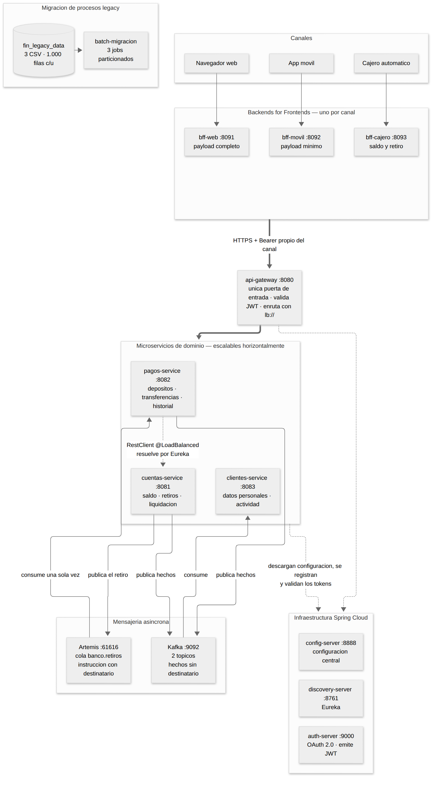
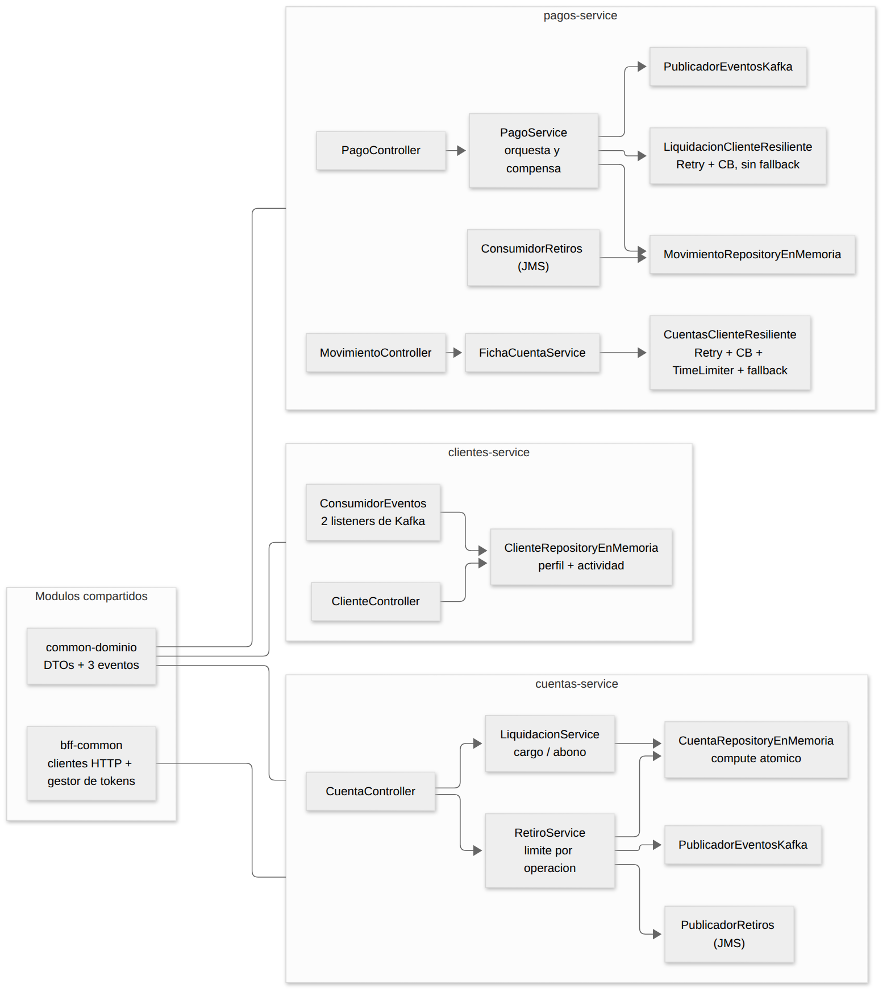
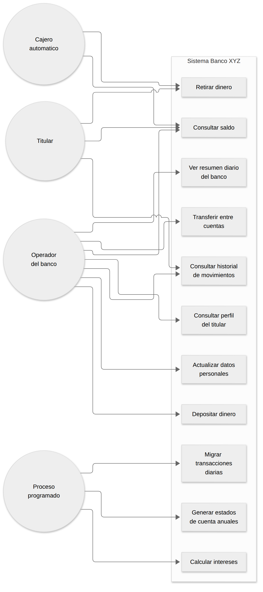
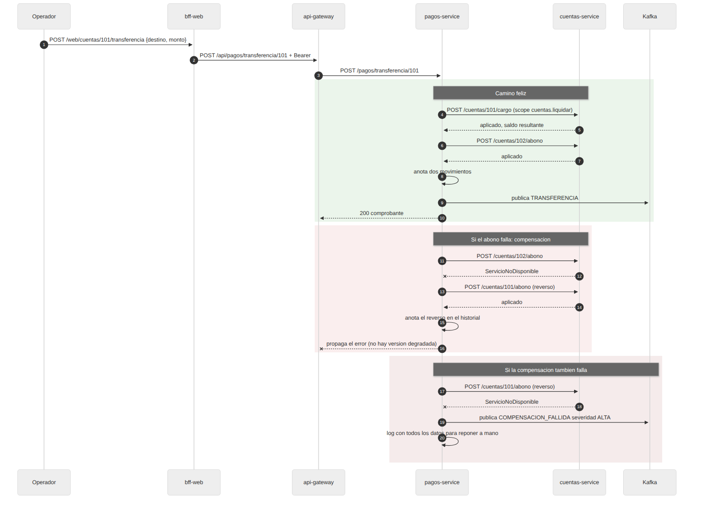
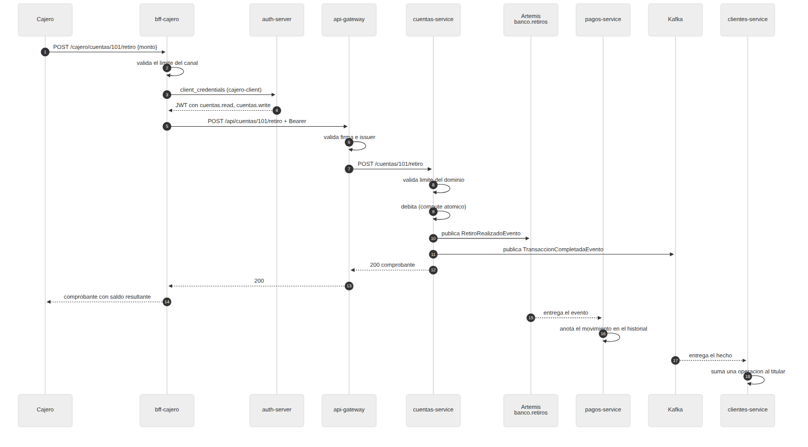
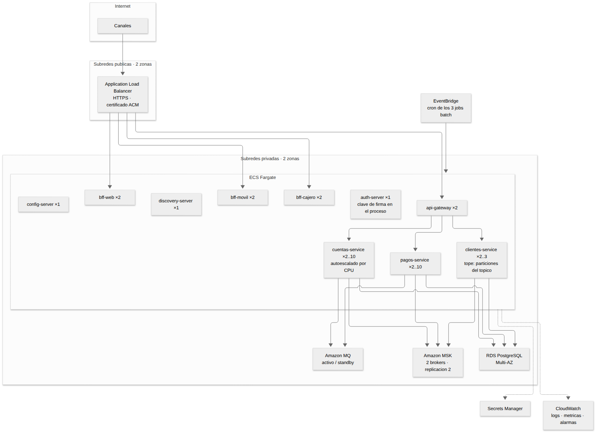

# Informe técnico
## Modernización del backend legacy del Banco XYZ

<div class="portada" markdown="1">

**Evaluación Final Transversal**

Desarrollo Backend III (PBY2203) · Semana 9

**Ignacio Miño Astorga**

Analista Programador Computacional · Duoc UC

Repositorio: <https://github.com/Ign14/DB3_ExpSumativas>

Carpeta del proyecto: `EFT_S9_Backend_Avanzado`

</div>

<div class="salto"></div>

## 1. Resumen ejecutivo

El Banco XYZ opera desde hace más de treinta años sobre COBOL y scripts Shell en
mainframe. El sistema funciona, y ese es parte del problema: funciona lo
suficiente como para que reemplazarlo parezca caro, y lo justo como para que cada
cambio cueste meses. Tres informes críticos —transacciones diarias, intereses y
estados de cuenta anuales— corren por lotes sobre archivos planos; tres canales
distintos —navegador, aplicación móvil y cajero automático— piden lo mismo a un
backend monolítico que no distingue entre ellos; y un fallo en cualquier módulo
afecta al sistema entero.

Este proyecto entrega el reemplazo. Son **quince módulos Maven** que cubren las
tres piezas del problema y se despliegan juntos:

Los **procesos batch** se reescribieron en Spring Batch, con particionamiento,
políticas de omisión y reintento, y reejecución automática ante fallos críticos.
Procesan las mismas tres mil filas del sistema legacy —con sus errores
intencionales— sin detenerse, y dejan registrada cada anomalía con su motivo.

El **patrón Backend for Frontend** da a cada canal su propio backend. La misma
cuenta se sirve en 4.914 bytes al navegador, 215 a la aplicación móvil y 39
al cajero, y cada canal tiene credenciales y permisos distintos.

Los **microservicios** parten el dominio en tres servicios independientes, con
configuración centralizada, descubrimiento dinámico, OAuth 2.0 con JWT validado
en dos capas, tolerancia a fallos con Resilience4j y una arquitectura de eventos
sobre Kafka y JMS. Los tres escalan horizontalmente sin cambiar configuración.

El estado del sistema, medido: **168 pruebas automatizadas sin librerías de
mocks** y **veintiséis registros de ejecución** repartidos en tres entornos
—once sobre los jar, ocho sobre contenedores en el equipo de desarrollo y siete
en una **instancia EC2 de AWS**, con el sistema completo y sus dos brokers de
mensajería corriendo fuera del equipo de desarrollo—. El ciclo completo del
circuit breaker —`CLOSED → OPEN → HALF_OPEN → CLOSED`— está capturado sobre
contenedores reales en los dos últimos.

Este informe describe qué se construyó, por qué se tomó cada decisión, qué
problemas aparecieron durante el desarrollo y qué falta. La última sección es
deliberadamente específica: hay cinco cosas que este sistema necesita antes de
ver tráfico real, y están nombradas con su motivo.

---

## 2. Requerimientos clave del negocio

Antes de la arquitectura están los requerimientos, porque son los que la
justifican. Del caso del Banco XYZ se desprenden tres, y cada decisión técnica de
este informe responde a alguno.

### 2.1 Continuidad operacional durante y después de la migración

El banco no puede apagar el sistema legacy y encender el nuevo. Los informes
diarios tienen que seguir saliendo, y los resultados del sistema nuevo tienen que
ser **equivalentes** a los del antiguo, no parecidos.

Qué implica, concretamente: los procesos batch deben leer los mismos archivos,
aplicar las mismas reglas y producir las mismas salidas; los datos sucios —que
el sistema legacy toleraba a su manera— no pueden detener un proceso completo; y
un fallo transitorio de infraestructura no puede dejar un informe sin generar sin
que nadie se entere.

**Cómo lo responde la arquitectura:** tres Jobs independientes con
particionamiento, política de omisión por registro con el motivo registrado,
reintento de chunk para el fallo transitorio, reejecución automática del Job para
el fallo crítico, y un código de salida distinto de cero cuando algo quedó sin
procesar.

### 2.2 Independencia entre canales y velocidad de desarrollo

Hoy los tres frontends dependen del mismo backend, lo que significa que ninguno
puede evolucionar sin coordinarse con los otros dos, y que todos reciben los
mismos datos aunque muestren cosas distintas. El banco necesita que el equipo de
la aplicación móvil pueda cambiar su pantalla sin esperar al equipo del cajero.

Qué implica: cada canal debe tener un backend propio, desplegable por separado,
con una API ajustada a lo que ese canal muestra; y la seguridad debe distinguir
entre canales, porque no tienen el mismo riesgo.

**Cómo lo responde la arquitectura:** tres BFF independientes, cada uno con su
propio cliente OAuth 2.0 y sus propios scopes. El canal móvil no tiene ningún
permiso de escritura; el cajero no puede leer datos personales ni historiales.

### 2.3 Resiliencia y escalabilidad bajo carga variable

Un banco tiene carga desigual: fin de mes, día de pago, horario comercial. Y
tiene dependencias que fallan. El sistema debe seguir sirviendo lo que pueda
cuando una parte se cae, y debe poder crecer en la parte que lo necesite sin
crecer entera.

Qué implica: ningún componente puede ser un punto único de falla por diseño; una
dependencia caída debe degradar la respuesta, no tumbarla; y agregar capacidad a
un servicio no debe requerir cambiar configuración de los demás.

**Cómo lo responde la arquitectura:** circuit breaker con respuesta degradada
sobre las consultas, rechazo honesto sobre las operaciones que mueven dinero,
mensajería asíncrona que desacopla productores de consumidores, y balanceo de
carga sobre un registro de servicios que permite replicar cualquier microservicio
con una bandera.

---

## 3. Los cinco procesos de la migración

La modernización se descompone en cinco procesos, y conviene verlos juntos antes
del detalle porque cada uno habilita al siguiente.

| # | Proceso | Qué resuelve | Dónde está |
|---|---|---|---|
| 1 | **Migración de los procesos batch a Spring Batch** | Los tres informes críticos dejan de depender de COBOL | `batch-migracion` |
| 2 | **División del monolito en microservicios** | Cada dominio se despliega y escala por separado | `cuentas-service`, `pagos-service`, `clientes-service` |
| 3 | **Patrón Backend for Frontend** | Cada canal recibe lo que necesita, ni más ni menos | `bff-web`, `bff-movil`, `bff-cajero` |
| 4 | **Seguridad distribuida con Spring Cloud Security** | La autorización deja de ser central y se aplica en cada salto | `auth-server`, `api-gateway`, los tres microservicios |
| 5 | **Mensajería asíncrona con Kafka (y JMS)** | Los servicios dejan de llamarse entre sí para todo | Kafka, Artemis, los tres microservicios |

El orden no es arbitrario. Sin el proceso 1 no hay datos limpios con los que
alimentar nada. Sin el 2, no hay a quién ponerle un BFF delante. Sin el 4, el 2
abre una superficie de ataque en vez de resolver un problema. Y el 5 es el que
convierte un conjunto de servicios que se llaman entre sí en un sistema que
tolera que una parte se caiga.

---

## 4. Propuesta de arquitectura

### 4.1 Vista general



El sistema tiene cuatro capas y una sola puerta de entrada.

Los **canales** no hablan con el dominio: hablan con su BFF. El BFF agrega, 
recorta y traduce, y cruza el `api-gateway` con un token propio.

El **gateway** es la única puerta. Valida la firma y el issuer del JWT antes de
enrutar, y resuelve el destino por nombre de servicio en Eureka, no por host y
puerto. Esa segunda parte es lo que hace que replicar un microservicio sea
gratis.

Los **microservicios de dominio** son dueños de sus datos y de sus reglas. Se
hablan entre sí lo mínimo, y cuando lo hacen es con un token propio y con
políticas de resiliencia encima.

La **mensajería** desacopla lo que no necesita respuesta inmediata, y usa dos
tecnologías distintas a propósito (sección 5.5).

### 4.2 Componentes y responsabilidades



| Módulo | Puerto | Responsabilidad |
|---|---|---|
| `common-dominio` | — | DTOs de las APIs y los tres eventos. Es el único contrato compartido, y lo usan tanto los microservicios como los BFF |
| `batch-migracion` | — | Los tres Jobs de Spring Batch |
| `config-server` | 8888 | Sirve la configuración de todo el ecosistema, con autenticación básica |
| `discovery-server` | 8761 | Eureka, con autenticación básica |
| `auth-server` | 9000 | Spring Authorization Server: emite JWT por `client_credentials` |
| `api-gateway` | 8080 | Valida el token y enruta con `lb://` |
| `cuentas-service` | 8081 | Saldo, titular, retiros y las primitivas de liquidación |
| `pagos-service` | 8082 | Depósitos, transferencias, historial y el reporte diario |
| `clientes-service` | 8083 | Datos personales y la proyección de actividad desde Kafka |
| `broker-artemis` | 61616 | Broker JMS de la cola de retiros |
| `broker-kafka` | 9092 | Broker Kafka para la ejecución local sin Docker |
| `bff-common` | — | Clientes HTTP y gestor de tokens compartidos por los tres canales |
| `bff-web` | 8091 | Canal web: consola administrativa |
| `bff-movil` | 8092 | Canal móvil: payload mínimo |
| `bff-cajero` | 8093 | Canal cajero: saldo y retiro |

### 4.3 Casos de uso



Hay cuatro actores y la distinción importa, porque es la que determina los
permisos. El **titular** consulta y retira; el **operador del banco** hace todo
lo anterior más mover dinero y editar datos personales; el **cajero automático**
es un actor por sí mismo, con el conjunto de operaciones más pequeño; y el
**proceso programado** ejecuta los tres jobs batch sin intervención humana.

---

## 5. Decisiones técnicas y su justificación

Esta sección es el núcleo del informe. Cada decisión se presenta con la
alternativa que se descartó, porque una decisión sin alternativa descartada no
es una decisión.

### 5.1 Tres niveles de respuesta al fallo en el batch

**El problema.** El dataset legacy trae mil filas por archivo con errores
sembrados: montos negativos y cero, fechas en cuatro formatos distintos, campos
vacíos, edades de 100 y de 5, tipos de cuenta que dicen `-1`, cuentas duplicadas
con valores que no coinciden. Un proceso que se detiene ante la primera fila mala
no sirve; uno que las acepta todas corrompe los datos.

**La decisión.** Tres niveles distintos, porque son tres problemas distintos:

| Nivel | Qué es | Respuesta | Por qué |
|---|---|---|---|
| Fila inválida | Un monto negativo, una fecha imposible | Se omite, se registra la anomalía con su motivo, el proceso sigue | Es un problema del dato, no del sistema. Detenerse sería perder las 999 filas buenas |
| Fallo transitorio | La base rechaza una conexión por un instante | Reintento del chunk, hasta el límite configurado | Volver a intentar lo resuelve |
| Fallo crítico | La base se cae a mitad del Job | Reejecución automática del Job, hasta dos veces | Es lo que haría un operador, y automatizarlo ahorra la espera |

**La alternativa descartada.** Tratar todo como fallo transitorio. Habría
significado reintentar mil veces una fila que nunca va a validar, y un límite de
omisiones que nunca se alcanza porque las omisiones se disfrazan de reintentos.

**El detalle que casi se pasa por alto.** El `ResolverStyle.STRICT` del parser de
fechas. En el modo por defecto, `DateTimeFormatter` acepta `31/02/2024` y lo
convierte silenciosamente en el 29 de febrero. Un parser así "funciona" y
corrompe datos: un framework que arregla la basura por su cuenta es peor que uno
que falla.

Vale la pena decir cómo terminó estando ahí, porque la historia es más
instructiva que la decisión. El sistema tenía **dos copias** de este parser: la
de `pagos-service`, que era estricta y tenía un test con `31/02/2024`, y la de
`batch-migracion`, que no era ninguna de las dos cosas. Los documentos
describían la versión estricta hablando del batch. Ninguna prueba comparaba las
dos copias, así que nada fallaba. Lo detectó una auditoría del proyecto
terminado, y la sección 7.6 cuenta el resto.

### 5.2 Un límite por canal además del límite del dominio

**El problema.** ¿Dónde vive el límite máximo de un retiro?

**La decisión.** En los dos lados, con significados distintos. El cajero rechaza
sobre 500.000 antes de llamar a nadie, porque un cajero dispensa billetes y tiene
restricciones físicas que la cuenta no conoce. `cuentas-service` tiene su propio
límite configurable, que es la regla del negocio y se puede cambiar en el Config
Server sin recompilar. Y la suficiencia de fondos es una invariante del dominio
que vive dentro de la operación atómica del repositorio.

**Por qué no es duplicación.** Validar en el canal ahorra una llamada remota para
algo que se resuelve mirando el cuerpo de la petición. Y los tres límites
responden preguntas distintas: cuánto puede dispensar esta máquina, cuánto
permite el banco por operación, y cuánto hay en la cuenta.

### 5.3 Invariantes dentro de la operación atómica

**El problema.** El registro de una cuenta es inmutable y cada débito lo
reemplaza por otra instancia. Dos retiros simultáneos sobre la misma cuenta
pueden partir del mismo saldo y perderse uno.

**La decisión.** Leer el saldo, validar los fondos y escribir el nuevo saldo son
una sola operación atómica sobre la clave, usando `ConcurrentHashMap.compute`. Y
las invariantes —monto positivo, saldo no negativo— se comprueban **dentro** de
ese bloque, no en la capa de servicio.

**Por qué ahí y no en el servicio.** Parece inofensivo mientras haya un solo
llamador, pero un monto negativo en un `subtract` aumenta el saldo. El segundo
llamador que aparezca podría crear dinero de la nada. Una invariante que vive
fuera de la operación atómica no es una invariante.

Hay tests de concurrencia con veinte hilos sobre los tres repositorios que
cubren este caso.

### 5.4 Seguridad: dos barreras y seis scopes

**El problema.** ¿Dónde se valida el token, y con qué granularidad?

**La decisión.** Dos barreras que no se reemplazan entre sí. El **gateway** valida
firma e issuer antes de enrutar, de modo que un token inválido no consume
recursos de ningún microservicio. Cada **microservicio** vuelve a validar y
además comprueba el scope concreto que exige cada endpoint.

**La alternativa descartada.** Validar sólo en el gateway. Habría significado que
cualquier proceso dentro de la red interna pudiera llamar a los servicios sin
token: el gateway sería una puerta con un muro de un metro al lado.

**Los seis scopes y su reparto:**

| Cliente | Scopes | Justificación |
|---|---|---|
| `banco-web-client` | los seis | Consola administrativa: el único que mueve dinero por transferencia y edita datos personales |
| `banco-movil-client` | `cuentas.read`, `movimientos.read`, `clientes.read` | Un teléfono que se pierde, se presta o se roba no debe poder mover dinero con el token que lleva dentro |
| `cajero-client` | `cuentas.read`, `cuentas.write` | Un cajero comprometido no debe convertirse en una fuente de información personal |
| `pagos-service` | `cuentas.read`, `cuentas.liquidar` | Necesita mover las puntas de una transferencia, no pedir retiros |

**El scope que apareció durante el desarrollo.** Al agregar las transferencias,
`pagos-service` necesitaba mover saldo. Lo rápido era darle `cuentas.write`, que
ya existía. Pero `cuentas.write` autoriza a pedir un retiro, que es una operación
de canal con su límite y su evento, y este servicio no tiene por qué poder
pedirla. De ahí salió `cuentas.liquidar`, un scope que no tiene ningún canal: el
mínimo privilegio no se reparte usando el permiso que ya existe porque alcanza,
se crea el permiso que describe lo que esa parte hace.

El efecto se puede comprobar en la evidencia: el token del cajero, con firma
perfectamente válida, recibe 200 en `/api/cuentas/101` y **403** en
`/api/movimientos/101` y `/api/clientes/101`.

### 5.5 Dos brokers, no uno

**El problema.** El caso pide Kafka. El sistema ya tenía JMS funcionando. Lo
cómodo era migrar todo a Kafka.

**La decisión.** Quedarse con los dos, porque llevan mensajes de naturaleza
distinta:

| | Cola JMS | Tópico Kafka |
|---|---|---|
| Qué lleva | Una **instrucción** con destinatario | Un **hecho** sin destinatario |
| Ejemplo | "Anota este retiro en el historial" | "Esta transacción ocurrió" |
| Cuántas veces se procesa | Exactamente una | Una vez por cada consumidor interesado |
| Si el consumidor está caído | El mensaje espera | El evento queda en el tópico con su retención |
| Consumidores futuros | Le robarían mensajes al primero | Se suman sin que el productor cambie |

**Por qué no uno solo.** Con una sola cola, el segundo consumidor que apareciera
le robaría mensajes al primero. Con un solo tópico, habría que inventar la
garantía de procesamiento único que la cola ya da.

**Tres detalles de la configuración de Kafka que importan:**

La **clave del mensaje es el número de cuenta**. Kafka ordena dentro de una
partición y una misma clave cae siempre en la misma partición, así que un
consumidor nunca ve el segundo retiro de una cuenta antes que el primero, aunque
el tópico tenga tres particiones.

El **consumidor declara a qué tipo deserializar**, en vez de leerlo del encabezado
que escribe el productor. Ese encabezado acopla los servicios por el nombre de
sus paquetes y, peor, le pediría a este proceso instanciar una clase cualquiera
del classpath si alguien lo manipulara.

Cada deserializador va envuelto en **`ErrorHandlingDeserializer`**. Sin eso, un
mensaje con JSON inválido hace fallar la deserialización antes de que el listener
exista, el contenedor reintenta el mismo offset para siempre, y el consumo del
tópico se detiene. Un solo mensaje mal formado basta para dejar de procesar todo
lo que venga detrás.

### 5.6 Tolerancia a fallos: dónde hay fallback y dónde no

**El problema.** `pagos-service` llama a `cuentas-service` para dos cosas muy
distintas: leer datos de una cuenta y mover su saldo. ¿La misma política para
las dos?

**La decisión.** No. Y es la decisión más importante del sistema en materia de
resiliencia.

La **consulta de la ficha** lleva `Retry`, `CircuitBreaker`, `TimeLimiter` y
**fallback**. Si la dependencia no responde, se entrega el historial sin los
datos de la cuenta, marcado como `DEGRADADO`. Para quien consulta movimientos, el
nombre del titular es un adorno; el historial es el dato que vino a buscar.

Las **primitivas de liquidación** llevan `Retry` y `CircuitBreaker` pero
**deliberadamente ningún fallback**. Un cargo que no se pudo aplicar no tiene
versión degradada: o el dinero se movió o no se movió. Devolver "aprobado en modo
degradado" sería decirle al cliente que su transferencia salió cuando el saldo no
cambió. La excepción tiene que subir para que quien orquesta la operación la
compense o la rechace.

**El orden de las anotaciones.** Resilience4j envuelve de afuera hacia adentro
como `Retry`, `CircuitBreaker`, `TimeLimiter`, así que el fallback va declarado
en `@Retry`, la capa más externa. Si estuviera en `@CircuitBreaker`, el primer
fallo se convertiría en un valor de retorno válido, `Retry` vería éxito y no
reintentaría nunca.

**El presupuesto de tiempo.** Los números tienen que ser coherentes entre capas o
se estorban:

```
por intento:  1 s de conexión + 1 s de lectura = 2 s, acotados por el TimeLimiter en 2 s
peor caso:    2 s + 0,2 s de espera + 2 s = 4,2 s hasta la respuesta degradada
```

Si el TimeLimiter fuera más corto que el peor caso del HTTP, cortaría la espera
del cliente pero dejaría la petición viva ocupando un hilo. Si fuera más largo,
el que acotaría de verdad sería el cliente HTTP y el TimeLimiter no serviría de
nada.

**Qué cuenta como fallo.** Sólo `ServicioNoDisponibleException` y
`TimeoutException`. Un 404 significa que el servicio respondió bien y la cuenta
no existe: si contara como fallo, consultar cuentas inexistentes abriría el
circuito de las válidas. Un 401 o un 403 son un problema de configuración
permanente, y abrir el circuito sólo lo disfrazaría de caída pasajera.

### 5.7 Consistencia de una transferencia distribuida



**El problema.** Una transferencia son dos llamadas remotas y no existe una
transacción que abarque a las dos. Es el primer caso del sistema donde no hay
respuesta correcta y hay que elegir qué equivocación es más barata.

**La decisión, en tres partes:**

**Se carga antes de abonar.** Si falla la primera punta, no hay nada que
deshacer. Al revés —abonar y después cargar— un fallo en la segunda dejaría
dinero creado, que es el error más caro de los dos.

**Se compensa la punta aplicada.** Si el abono al destino falla, se devuelve el
monto a la cuenta de origen y queda un movimiento de reverso en el historial. Es
una compensación de negocio, no un rollback: las tres operaciones dejan rastro.

**Si la compensación también falla, se grita.** Ahí hay un descalce contable
real. Se registra con severidad alta, con todos los datos necesarios para
reponerlo a mano, y se publica en el tópico de alertas. No se reintenta en un
bucle ni se traga el error.

**Lo que falta y por qué.** Una clave de idempotencia por operación permitiría
reintentar sin duplicar, y un registro durable de operaciones en curso permitiría
retomar la compensación si el proceso se cae en el peor momento. Con estado en
memoria no se puede sostener ninguna de las dos. Está dicho en el código, en el
`readme.md` y en la sección 9 de este informe.

Los doce tests de `PagoServiceTest` cubren estos caminos; cuatro de ellos son
específicamente sobre compensación.

### 5.8 Balanceo del lado del cliente, no por el gateway

**El problema.** `pagos-service` llama a `cuentas-service`. Si hay dos instancias
de `cuentas-service`, ¿cómo se reparte ese tráfico?

**La decisión.** Un `RestClient` marcado con `@LoadBalanced`, cuya URL base es el
nombre del servicio en Eureka (`http://cuentas-service`) y no un host fijo.
Spring Cloud resuelve una instancia distinta en cada petición.

**La alternativa descartada.** Mandar el tráfico interno por el `api-gateway`,
que también balancea. Habría funcionado, pero agrega un salto de red a cada
llamada entre servicios y convierte la puerta de entrada en un cuello de botella
por el que tendría que fluir también todo el tráfico interno.

**El resultado medido:** con dos instancias levantadas, treinta peticiones por el
gateway se repartieron 15 y 15, y veinte llamadas entre servicios se repartieron
10 y 10, contadas en los logs de acceso de cada instancia.

---

## 6. Resultados y comparación con el sistema legacy

### 6.1 Comparación estructural

| Dimensión | Sistema legacy | Sistema nuevo |
|---|---|---|
| **Plataforma** | COBOL y Shell sobre mainframe | Java 21, Spring Boot 3.3, contenedores |
| **Procesos batch** | Secuenciales, un solo hilo | Particionados en cuatro, en paralelo, con grilla configurable |
| **Ante un dato sucio** | Comportamiento del sistema antiguo, no auditable | Se omite, se registra la anomalía con su motivo y el proceso sigue |
| **Ante un fallo crítico** | Intervención manual | Reejecución automática y código de salida que un cron puede detectar |
| **Canales** | Un backend para los tres | Un backend por canal, desplegable por separado |
| **Payload para la misma cuenta** | El mismo para todos | 4.914 / 215 / 39 bytes según el canal |
| **Seguridad** | Centralizada | OAuth 2.0 con JWT, seis scopes, validación en dos capas |
| **Ante la caída de un módulo** | Afecta al sistema completo | El circuito se abre, la respuesta se degrada y el evento espera en la cola |
| **Escalar** | Toda la plataforma | Un servicio, con una bandera |
| **Despliegue** | Proceso del mainframe | `docker compose up -d`, once imágenes construidas desde el repositorio |
| **Configuración** | En cada programa | Centralizada, versionada y autenticada |
| **Pruebas automatizadas** | No documentadas | 168, sin librerías de mocks |

### 6.2 Resultados medidos

**Procesamiento batch.** Los tres jobs procesan 1.000 filas cada uno, repartidas
en cuatro particiones que corren en paralelo, en menos de dos segundos por job:

| Job | Escritos | Omitidos |
|---|---|---|
| Reporte de transacciones diarias | 392 | 608 |
| Cálculo de intereses | 422 | 578 |
| Estados de cuenta anuales | 604 | 396 |

Las omisiones no son fallos: son exactamente los errores que el dataset trae
sembrados, cada uno registrado con su motivo. El archivo de movimientos diarios
es el más sucio de los tres, con un 60 % de filas inválidas.

Esa cifra obligó a calibrar el límite de omisiones y, al hacerlo, apareció algo
que no es evidente: Spring Batch aplica el límite **por ejecución de Step, no por
archivo**, así que con particionamiento cada partición lleva su propia cuenta.
Con el límite en 200, este archivo fallaba con una partición y pasaba con cuatro.
Quedó en 700 para que el resultado sea el mismo con cualquier grado de
paralelismo, que es lo mínimo que se le pide a un proceso por lotes.

**Diferenciación por canal.** Para la cuenta 101, el canal web devuelve 4.914
caracteres con el historial completo, el perfil del titular y los totales; el
móvil, 215 con el saldo y tres movimientos de tres campos cada uno; el cajero,
39 con el número de cuenta y el saldo. Dos órdenes de magnitud entre los
extremos.

**Control de acceso.** Siete combinaciones de canal y recurso probadas: el cajero
recibe 403 en movimientos y en clientes, el canal móvil recibe 403 al intentar
escribir, y ningún canal puede liquidar saldo directamente.

**Tolerancia a fallos.** Con `cuentas-service` detenido, el circuito pasó a
`OPEN` tras la segunda petición y las siguientes respondieron de inmediato en
modo degradado, sirviendo el historial completo. Al volver a levantar el
servicio, el circuito recorrió `CLOSED → OPEN → HALF_OPEN → CLOSED` y volvió a
cerrarse solo, sin intervención: diez segundos en abierto, una prueba en medio
abierto que pasó, y el tráfico restablecido.

Sobre contenedores, donde el servicio tarda más en estar listo, es normal ver una
variante: `HALF_OPEN → OPEN → HALF_OPEN → CLOSED`, porque la prueba en medio
abierto llega mientras el contenedor todavía descarga su configuración y se
registra en Eureka. Es el mismo mecanismo y, si aparece, es mejor evidencia que
un ciclo limpio, porque es lo que pasaría en un incidente real.

**Mensajería.** Un retiro bajó el saldo en `cuentas-service` y apareció en el
historial de `pagos-service` sin que un servicio llamara al otro. Con el
consumidor detenido, el retiro se aprobó igual y el evento esperó en la cola
hasta que el consumidor volvió. En Kafka, cuatro transacciones y una alerta
llegaron a `clientes-service`, que actualizó la actividad de dos titulares
distintos a partir de una sola transferencia.

**Escalabilidad.** Dos instancias de `cuentas-service` registradas en Eureka,
treinta peticiones repartidas 15 y 15 por el gateway y veinte llamadas entre
servicios repartidas 10 y 10, sin cambiar configuración de ningún componente.

### 6.3 Lo que el sistema nuevo todavía no mejora

Para que la comparación sea honesta: el sistema legacy **persiste** sus datos y
este no. Los tres microservicios cargan los CSV al arrancar y mantienen el estado
en memoria, así que un reinicio pierde los movimientos de la sesión. En esa
dimensión concreta, el sistema antiguo es mejor hoy. Es el primer punto de la
sección 9.

---

## 7. Desafíos enfrentados y soluciones

### 7.1 La infraestructura estaba abierta

**El problema.** Revisando el proyecto ya terminado apareció que los componentes
de infraestructura no pedían credenciales. El más grave era el **Config Server**:
devuelve la configuración completa de todos los microservicios, y ahí dentro
viaja el secreto del cliente OAuth 2.0 de `pagos-service`. Un `GET` anónimo
entregaba una credencial con la que cualquiera podía pedirle al `auth-server` un
JWT perfectamente válido. Todo el esquema de scopes quedaba neutralizado por la
puerta de al lado.

**Eureka** era el segundo: el registro decide a dónde va el tráfico, así que
cualquiera podía dar de baja un servicio o registrar uno propio con el nombre de
`cuentas-service` y recibir las peticiones del gateway. **Artemis** era el
tercero: Spring Boot configura el broker embebido con `setSecurityEnabled(false)`,
y con un acceptor TCP abierto eso deja un camino de escritura al dominio que no
pasa por ningún token.

**La solución.** Autenticación básica en el Config Server y en Eureka; y en
Artemis, un único usuario con un rol acotado y la seguridad encendida a mano con
un `BeanPostProcessor`, porque Spring Boot no ofrece un punto de extensión para
ponerla.

**Lo que dejó.** Encender la seguridad de Artemis rompió el indicador de salud de
Spring Boot, que usa una factoría de conexiones sin credenciales y reportaba
`DOWN` con el broker sano. Se reemplazó por un indicador propio que le pregunta
al servidor embebido.

### 7.2 El servicio que arrancaba sano y respondía otra cosa

**El problema.** Los tres BFF quedaron `UP` según sus logs, pero su endpoint de
salud devolvía 302. El healthcheck los daba por caídos y no había ningún error en
ningún log.

**La causa.** Los BFF dependen de `spring-boot-starter-oauth2-client` para poder
pedir su token, y el solo hecho de tener esa dependencia en el classpath hace que
Spring Security proteja todas las rutas con un formulario de login. El servicio
estaba sano y respondiendo: respondiendo una redirección a una página de login.

**La solución.** Una cadena de filtros explícita en el módulo común, con la
decisión documentada: los BFF no autentican al usuario final en esta entrega
porque el flujo del sistema es `client_credentials` —se autentican aplicaciones,
no personas—, y lo que cada BFF protege es el backend, no a sí mismo.

**Lo que enseñó.** Un comportamiento por defecto que nadie eligió es más difícil
de encontrar que un error, porque no deja rastro. El healthcheck que mira el
código de respuesta y no sólo si el puerto contesta fue lo que lo delató.

### 7.3 La transferencia que puede quedar a medias

**El problema.** Descrito en la sección 5.7. No tiene solución completa sin
persistencia.

**La solución parcial, y por qué se asumió.** Cargar antes de abonar, compensar
si falla, y gritar si la compensación falla. Las tres partes tienen tests. Lo que
no se hizo fue fingir que el problema está resuelto: la clave de idempotencia
faltante está escrita en el código, en el `readme.md` y en la sección 9.

### 7.4 Integrar no era juntar

**El problema.** La primera idea fue que integrar las tres experiencias era
ponerlas en una carpeta y escribir un documento que las explicara.

**Lo que apareció al unirlas.** Los BFF de la semana 5 hablaban con dos servicios
"core" propios que, en el sistema integrado, ya no tenían razón de existir: los
microservicios cubren el mismo dominio, mejor. Los BFF pasaron a consumir el
gateway y tuvieron que volverse clientes OAuth 2.0, algo que antes no
necesitaban.

Y el retiro por cajero cambió de forma: antes el BFF orquestaba dos llamadas y
cargaba con el problema de que la segunda fallara después de que el dinero ya
había salido. Con la cola, esa orquestación dejó de ser suya. **Es el único caso
del proyecto en que agregar una capacidad de arquitectura eliminó código de otra
capa en vez de agregarlo.**

### 7.5 El contrato duplicado que mostraba cero

**El problema.** El canal web devolvía, para una cuenta con cuarenta
movimientos, un resumen que decía `"cantidadMovimientos": 0` y
`"ultimoMovimientoFecha": null`. Los totales de depósitos y egresos salían
correctos. Nada fallaba, ningún log decía nada, y los otros dos canales estaban
bien.

**La causa.** Al integrar las tres experiencias, el módulo común de los BFF se
quedó con su propia copia de los DTOs en vez de usar el contrato del dominio.
Las dos copias eran casi iguales, y ese "casi" era todo: el microservicio
publica `totalMovimientos` y `ultimaFecha`, la copia del BFF los llamaba
`cantidadMovimientos` y `ultimoMovimientoFecha`. Jackson no tiene por qué
quejarse de un campo que no reconoce ni de uno que no viene: deserializa lo que
coincide y deja el resto en su valor por defecto. Cero y nulo.

**La solución.** Eliminar la duplicación, no renombrar los campos. El módulo de
los BFF pasó a depender de `common-dominio` y los nueve records duplicados
desaparecieron. El único que se conservó es el comprobante que el cajero le
entrega al titular, que sí es distinto del que devuelve el dominio, y se
renombró a `ComprobanteRetiro` para que el código diga que son dos cosas
distintas.

**Lo que enseñó.** Dos copias de un contrato no son redundancia: son dos
contratos que se parecen hasta que dejan de parecerse, y el día que dejan de
parecerse nadie se entera, porque la serialización no falla, rellena. Es el
argumento más concreto que encontré a favor de un módulo de contratos
compartido, y lo encontré teniéndolo ya escrito en el informe y sin cumplirlo.

### 7.6 Lo que encontró auditar el proyecto terminado

Las dos secciones anteriores y la 7.1 tienen algo en común que conviene decir
explícito: **ninguno de esos tres defectos apareció probando el sistema**. La
infraestructura sin autenticación, el parser que decía ser estricto y no lo era,
y el contrato duplicado que mostraba cero, los tres pasaron por delante de 136
pruebas en verde y de una evidencia de ejecución completa.

Aparecieron al revisar el proyecto ya terminado preguntando qué podía estar mal,
que es una actividad distinta de probar que lo construido funciona. Las pruebas
responden "¿hace lo que le pedí?"; la revisión responde "¿qué le pedí que no
debería haberle pedido, y qué no le pedí?".

De esa revisión salieron además las pruebas que faltaban, y la suite pasó de 136
a 168: las reglas de autorización por endpoint, que eran la afirmación de
seguridad central del proyecto y no tenían ninguna; el caso de las fechas
imposibles en el parser del batch, que es el que habría detectado el defecto
años antes; la concurrencia del repositorio de movimientos, que dos documentos
daban por cubierta y no lo estaba; y la agregación del canal web, que era el BFF
más complejo y el único sin pruebas.

### 7.7 Un script que se corrompió a sí mismo

**El problema.** Durante la generación de la evidencia, el script de ejecución
falló a mitad de camino con un error de sintaxis en una línea que estaba
perfectamente escrita.

**La causa.** Bash lee los scripts de forma incremental, no completa. Editar el
archivo mientras corre desplaza los desplazamientos de bytes y el intérprete
retoma la lectura en una posición desfasada, partiendo una palabra por la mitad.

**La solución.** Esperar a que termine antes de editarlo. Vale anotarlo porque es
un modo de falla que no se parece a un error del programa y hace perder tiempo
buscando en el lugar equivocado.

---

## 8. Pruebas y evidencia

### 8.1 Estrategia de pruebas

**168 pruebas automatizadas, sin librerías de mocks.** Los dobles de prueba están
escritos a mano, y la razón es concreta: las librerías de mocks instrumentan
bytecode y se rompen al cambiar de versión del JDK. Este proyecto se desarrolló
con JDK 24 y compila con `release 21`, y tiene que correr igual donde se revise.
La evidencia de `evidencia/local/` se generó con JDK 21 sobre Linux —así lo
declara la cabecera de `01_compilacion_y_pruebas.log`—, lo que es la
comprobación de que el bytecode es el mismo en los dos.
Una subclase de tres líneas no tiene ese problema.

| Módulo | Pruebas | Qué cubren |
|---|---|---|
| `batch-migracion` | 15 | Los tres procesadores, el parser de fechas legacy —incluidas las fechas imposibles— y las reglas de validación |
| `auth-server` | 10 | El mínimo privilegio de cada canal, con igualdad exacta de conjuntos |
| `cuentas-service` | 33 | Retiros, liquidación, eventos publicados, concurrencia de veinte hilos y las reglas de autorización por endpoint |
| `pagos-service` | 66 | Resiliencia cableada, orquestación de pagos, compensación, consumo JMS, concurrencia y reglas de autorización |
| `clientes-service` | 22 | Carga del padrón, proyección de eventos, concurrencia y reglas de autorización |
| `bff-web` | 8 | Agregación de cuatro llamadas y la degradación parcial cuando falta el perfil |
| `bff-movil`, `bff-cajero` | 14 | Recorte por canal y límites del canal |

Tres elecciones que vale explicar.

Los tests del `auth-server` usan **igualdad exacta** de conjuntos de scopes y no
"contiene": un test que comprueba que el cajero contiene `cuentas.write` sigue
pasando el día en que alguien le agregue `clientes.read`, y ese es precisamente
el cambio que debería hacer ruido.

Los tests de concurrencia usan **veinte hilos con una barrera de partida**, no
llamadas secuenciales. Sin la barrera, los hilos se ejecutan de a uno y el test
pasa aunque el código no sea atómico.

Y los tres `ReglasDeAutorizacionTest` prueban la **cadena de filtros**, no los
controladores: levantan un contexto mínimo con la configuración de seguridad
real y un controlador de sonda que declara las mismas rutas sin lógica, de modo
que un 403 sólo puede venir de la autorización. Cubren el hueco que esta misma
suite tenía hasta hace poco: el `auth-server` verificaba qué scopes tiene cada
cliente, pero nada verificaba qué scope exige cada endpoint, así que la
distinción entre `cuentas.write` y `cuentas.liquidar` —la decisión de seguridad
más fina del sistema— podía romperse sin que fallara una sola prueba. Cada uno
termina comprobando que una ruta no declarada queda denegada, que es lo que hace
que un endpoint nuevo nazca cerrado.

### 8.2 Evidencia de ejecución

Tres conjuntos, que demuestran cosas distintas y por eso no se mezclan.
`evidencia/local/` contiene la ejecución sobre los jar, reproducible en cualquier
máquina con un JDK y sin depender de Docker. `evidencia/docker/` contiene la
ejecución sobre contenedores en el equipo de desarrollo, que demuestra que las
once imágenes se construyen y que la orquestación declarada levanta el
ecosistema. Y `evidencia/nube/` contiene la ejecución del sistema completo
—incluidos los dos brokers de mensajería— **dentro de una instancia EC2 de AWS**,
que es lo que demuestra que esto funciona fuera del equipo de desarrollo; sus
registros empiezan con los metadatos de la instancia leídos del servicio de
metadatos de AWS, porque un `docker compose ps` es idéntico en cualquier máquina
y sin esa cabecera no habría forma de distinguir una ejecución de la otra.

El índice de los tres conjuntos está en `evidencia/LEEME.md`. Los once registros
de `evidencia/local/`:

| Registro | Qué demuestra |
|---|---|
| `01_compilacion_y_pruebas` | Los quince módulos y las 168 pruebas |
| `02_batch_migracion` | Los tres jobs, el escalado por particiones y la política de finalización |
| `03_configuracion_y_discovery` | Config Server y Eureka autenticados, servicios registrados |
| `04_oauth2_y_control_de_acceso` | Token, claims, clave pública y los rechazos por canal y por scope |
| `05_apis_por_el_gateway` | Los tres microservicios respondiendo por el gateway |
| `06_mensajeria_jms` | El retiro que cruza dos servicios por la cola, y la cola reteniendo el evento |
| `07_mensajeria_kafka` | Los dos tópicos con productores y consumidores reales |
| `08_tolerancia_a_fallos` | El ciclo completo del circuit breaker con respuesta degradada |
| `09_bff_por_canal` | Los tres canales con payloads distintos para la misma cuenta |
| `10_escalabilidad_horizontal` | Dos instancias y el reparto de peticiones entre ellas |
| `11_estado_final` | Salud de los doce componentes y de la réplica levantada al escalar, más el registro final de Eureka |



---

## 9. Propuestas de mejora y próximos pasos

En orden de prioridad. Las cinco están nombradas en el código, donde
corresponde, con el motivo de por qué no se resolvieron.

### 9.1 Persistencia en base de datos

**Qué falta.** Los tres microservicios cargan los CSV al arrancar y mantienen el
estado en memoria.

**Por qué es lo primero.** Dos instancias de `cuentas-service` tienen cada una su
copia del saldo y divergen en cuanto alguien retira. El escalado horizontal que
este sistema demuestra es real en el reparto de tráfico, pero sólo es correcto
mientras los servicios no tengan estado propio que divergir. Es la diferencia
entre una demostración que funciona y un sistema que es correcto.

**Qué implica.** RDS PostgreSQL —el módulo batch ya trae el perfil `postgres`— y
reemplazar los repositorios en memoria por repositorios JPA. La arquitectura
distribuida no cambia.

### 9.2 La clave de firma del `auth-server` fuera del proceso

**Qué falta.** La clave RSA se genera al arrancar.

**Por qué importa.** Cada reinicio invalida los tokens vigentes, y dos instancias
del `auth-server` firman con claves distintas, de modo que un token emitido por
una no valida en la otra. Mientras siga así, ese servicio corre con una sola
instancia y es el único punto único de falla del sistema por diseño.

**Qué implica.** La clave en AWS Secrets Manager o KMS, compartida entre
instancias, con rotación solapada entre claves.

### 9.3 Clave de idempotencia por operación de pago

**Qué falta.** Una operación no se puede reintentar sin riesgo de duplicarla.

**Por qué importa.** Es lo que cierra el problema de la sección 5.7. Hoy el abono
de una transferencia no se reintenta —reintentar un abono que quizá sí se aplicó
regala dinero—, lo que significa que un fallo de red momentáneo en ese punto
dispara una compensación innecesaria.

**Qué implica.** Que `cuentas-service` recuerde las claves de operación ya
aplicadas, lo que a su vez requiere 9.1.

### 9.4 TLS y autenticación del usuario final

**Qué falta.** El tráfico interno va en claro, y nada verifica a la persona detrás
de un canal: los canales se autentican a sí mismos, no a quien los usa.

**Qué implica.** Terminación TLS en el balanceador —descrita en `despliegue.md`—
y una capa de autenticación de usuario por delante de cada BFF: sesión del
navegador, token de la aplicación móvil, certificado del cajero.

### 9.5 Trazabilidad distribuida

**Qué falta.** Hay endpoints de Actuator y logs por servicio, pero seguir un
retiro a través del gateway, dos microservicios, una cola y un tópico requiere
leer cinco logs y cruzarlos a mano.

**Qué implica.** Micrometer Tracing con OpenTelemetry, y un identificador de
correlación que viaje también en los mensajes de la cola y en los eventos del
tópico, que es la parte que la instrumentación automática no cubre.

### 9.6 Mejoras de menor prioridad

**Más particiones en los tópicos.** `clientes-service` consume de tópicos con
tres particiones, así que más de tres instancias no aumentan el consumo: Kafka
asigna como máximo una partición por consumidor dentro de un grupo. Si hiciera
falta escalar más allá de tres, primero hay que aumentar las particiones.

**Una cola de mensajes fallidos.** Hoy un evento que no se puede procesar se
registra y se descarta. Una *dead letter queue* permitiría reprocesarlo después.

**Fecha de actualización en el dataset.** El archivo de intereses repite cuentas
con valores distintos y no trae fecha para desempatar; se conserva la última fila
válida. Con datos reales, ese criterio debería reemplazarse por una fecha.

---

## 10. Despliegue



El detalle completo —comandos, definiciones de tarea, autoescalado, costos
estimados y verificación posterior— está en
[`despliegue.md`](../despliegue.md). Lo esencial:

Las imágenes van a **ECR** y se despliegan como servicios de **ECS
Fargate**, en subredes privadas de dos zonas de disponibilidad. Sólo el gateway y
los tres BFF se publican tras un **Application Load Balancer** con HTTPS; los
tres microservicios de dominio no tienen grupo de destino y sólo son alcanzables
desde dentro, igual que en `docker-compose.yml` no publican puertos al host.

Kafka pasa a **Amazon MSK** con dos brokers y replicación 2, que es lo que
convierte el `acks=all` del productor en una garantía real. JMS pasa a **Amazon
MQ** en activo/standby, porque la cola es la que garantiza que un retiro llegue
al historial y una cola en una sola zona es un punto único de falla sobre el dato
más sensible del sistema.

Los secretos van a **Secrets Manager** y se inyectan como variables de entorno;
el código no cambia, porque ya los lee del entorno con un valor por defecto para
la ejecución local.

Los tres jobs batch no son servicios: se ejecutan y terminan, así que van como
tareas programadas de **EventBridge**, cada una con su propia frecuencia. El
código de salida distinto de cero del proceso batch alimenta una alarma de
CloudWatch, que es lo que hace que un batch fallido se sepa el mismo día.

**El despliegue que sí se ejecutó.** La arquitectura administrada que describen
los párrafos anteriores —Fargate, MSK, Amazon MQ, RDS— está escrita con los
comandos completos pero no se levantó: mantenerla cuesta del orden de 600 USD al
mes, un orden de magnitud sobre la instancia única y tres sobre los veinte
centavos que costó esta demostración. Lo que sí se ejecutó, y es lo que
`evidencia/nube/` registra, es el **sistema completo sobre una instancia EC2**:
las once imágenes construidas dentro de la instancia, los trece contenedores en
`healthy` —doce residentes, incluidos Artemis y Kafka, es decir los dos brokers
corriendo en la nube y no en el equipo de desarrollo, más el de un solo uso que
crea los tópicos y termina—, los microservicios conectados a ellos, el ciclo del
circuit breaker sobre contenedores reales y dos réplicas de `cuentas-service`
registradas en Eureka. Los pasos están en la sección 11 de `despliegue.md`.

Una instancia única no demuestra tolerancia a la caída de una zona de
disponibilidad: eso es precisamente lo que aporta la arquitectura administrada, y
es la razón de describirla aunque no se haya levantado. La sección 0 de
`despliegue.md` separa las dos mitades antes que cualquier otra cosa.

---

## 11. Conclusión

El sistema entregado cumple lo que el caso pedía: los tres procesos batch
migrados a Spring Batch con escalado y tolerancia a fallos, el patrón BFF para
los tres canales con autenticación y autorización propias de cada uno, y tres
microservicios seguros y resilientes con Spring Cloud, Resilience4j, Kafka y JMS,
desplegables en contenedores y escalables horizontalmente.

Lo que no cumple está dicho con la misma claridad en la sección 9, y la razón de
escribirlo así es la que da el propio proyecto: durante el desarrollo, la falla
más grave —la infraestructura sin autenticación— no apareció probando lo que
estaba construido, sino preguntándose qué faltaba. Un informe que sólo enumera
logros no deja ese hallazgo por escrito para quien venga después.
