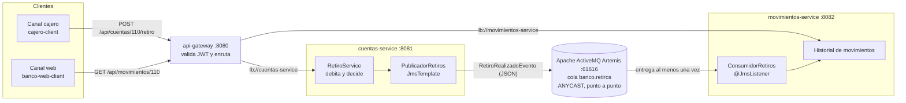

# Arquitectura de eventos del Banco XYZ

Documento de la decisión pedida en la semana 7: qué patrón de arquitectura de
eventos usar, qué mensajes viajan por el sistema y entre quiénes.

## 1. Patrón elegido

De los patrones posibles —*event notification*, *event-carried state transfer*,
*event sourcing* y *CQRS*— este proyecto implementa **event-carried state
transfer** sobre una **cola punto a punto** de JMS.

El evento no es un simple aviso de "pasó algo, ve a buscar los datos": lleva
dentro todo lo que el consumidor necesita (cuenta, monto, saldo resultante,
fecha y canal). Esa decisión es la que evita que `movimientos-service` tenga que
llamar de vuelta a `cuentas-service` al procesar cada retiro, que es
exactamente el acoplamiento que la mensajería venía a eliminar.

Se descartaron los otros tres:

- **Event notification** obligaría a una llamada HTTP de vuelta por cada evento,
  reintroduciendo la dependencia sincrónica.
- **Event sourcing** implica reconstruir el estado replicando el log completo de
  eventos. Es una decisión de almacenamiento de fondo, desproporcionada para un
  sistema cuyo estado son dos repositorios en memoria cargados desde CSV.
- **CQRS** separa modelos de lectura y escritura. Aquí la separación ya existe
  por otro eje (dos microservicios con dominios distintos), así que agregarlo
  sumaría complejidad sin resolver un problema presente.

## 2. Topología de mensajería

## 3. Catálogo de mensajes

| Destino | Tipo | Evento | Productor | Consumidor | Disparador |
|---|---|---|---|---|---|
| `banco.retiros` | Cola (ANYCAST) | `RetiroRealizadoEvento` | `cuentas-service` | `movimientos-service` | Un retiro aprobado, después de aplicar el débito |

### 3.1 Contrato del evento

`cl.duoc.bancoxyz.common.evento.RetiroRealizadoEvento`, en el módulo
`common-events`, que es lo único que los dos microservicios comparten:

| Campo | Tipo | Para qué lo usa el consumidor |
|---|---|---|
| `eventoId` | `String` (UUID) | Descartar reentregas: es la clave de idempotencia |
| `cuentaId` | `Long` | Cuenta cuyo historial se amplía |
| `monto` | `BigDecimal` | Monto del movimiento |
| `saldoResultante` | `BigDecimal` | Saldo con el que quedó la cuenta; sirve para conciliar |
| `fecha` | `String` (ISO-8601) | Fecha del movimiento |
| `canal` | `String` | Queda en la descripción del movimiento |

El mensaje viaja como JSON en un `TextMessage`, con el nombre de la clase en la
propiedad `_tipoEvento`. No se usa serialización binaria de Java: ataría el
consumidor al `serialVersionUID` del productor y haría ilegible el contenido de
la cola desde cualquier herramienta de inspección.

## 4. Por qué una cola y no un tópico

El evento tiene **un** consumidor y la operación debe ocurrir **una** vez: dos
instancias que procesaran el mismo retiro lo duplicarían en el historial. Una
cola ANYCAST entrega cada mensaje a un solo consumidor, así que al escalar
`movimientos-service` a varias instancias el broker reparte los eventos en vez
de repetirlos.

Un tópico tendría sentido si el retiro interesara a varios dominios a la vez
—por ejemplo, un servicio de notificaciones y otro de detección de fraude— y
cada uno necesitara su propia copia. Ese es el cambio que habría que hacer si
el sistema creciera en esa dirección: publicar en un tópico y suscribir a cada
dominio con su propia cola duradera.

## 5. Garantías y sus consecuencias

| Garantía | Qué implica en el código |
|---|---|
| Entrega **al menos una vez** | El consumidor es idempotente: `ConsumidorRetiros` recuerda los `eventoId` ya procesados y descarta la reentrega |
| Entrega **asíncrona** | El retiro se aprueba sin que `movimientos-service` esté arriba; el evento espera en la cola (evidencia `07_cola_retiene_eventos.log`) |
| **Sin transacción distribuida** | El débito y el registro del movimiento no son atómicos entre servicios: hay una ventana de milisegundos en que el saldo ya bajó y el historial todavía no lo refleja. Es consistencia eventual, aceptada a propósito |
| **Fallo al publicar** | No se revierte el retiro: el dinero ya salió. Se responde con `eventoPublicado: false`, queda en el log con su `eventoId` y el movimiento debe reponerse. El `callTimeout` del cliente está en 4 s para que un broker colgado no deje bloqueado el hilo que atiende el retiro los 30 s que trae por defecto |
| **Autenticación** | El broker exige usuario y clave, con un rol que solo puede enviar y consumir. Sin eso, publicar en la cola sería un camino de escritura al historial de una cuenta que no pasa por ningún token |

## 6. Lo que falta para producción

Cuatro cosas que este proyecto no implementa y que un sistema real necesitaría:

1. **Persistencia del broker.** Aquí el broker corre sin journal en disco, así
   que un reinicio del broker pierde los eventos pendientes. En producción se
   habilita la persistencia.
2. **Idempotencia compartida.** El registro de `eventoId` procesados vive en la
   memoria de la instancia, acotado a los últimos 10.000. Con varias instancias de
   `movimientos-service` hay que llevarlo a un almacén compartido.
3. **Cola de mensajes fallidos.** Hoy un evento con datos inválidos se descarta
   y queda en el log. Lo correcto es derivarlo a una *dead letter queue* para
   poder reprocesarlo después de corregirlo.
4. **Patrón outbox.** Si el broker rechaza el evento, el retiro queda aplicado y
   el movimiento perdido: solo hay un log con el `eventoId` para reponerlo a mano.
   Lo correcto es escribir el evento en la misma transacción que el débito y que un
   proceso aparte lo publique, de modo que no exista un estado en que el dinero se
   movió y el evento no existe en ninguna parte.
